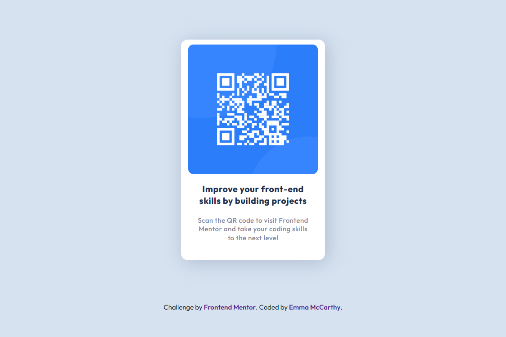

# Frontend Mentor - CSS & HTML: QR Code Component Solution

This is a solution to the [QR code component challenge on Frontend Mentor](https://www.frontendmentor.io/challenges/qr-code-component-iux_sIO_H). Frontend Mentor challenges help you improve your coding skills by building realistic projects. 

## Table of contents

- [Overview](#overview)
  - [Screenshot](#screenshot)
- [My process](#my-process)
  - [Built with](#built-with)
  - [What I learned](#what-i-learned)
  - [Continued development](#continued-development)
- [Author](#author)
- [Acknowledgments](#acknowledgments)

## Overview

### Screenshot:

### Built with:

- Semantic HTML5 markup
- CSS custom properties
- Flexbox

### What I learned:

I used this project to focus on how to use Flexbox to center the card both horizontally and vertically. I created one overall DIV container and set to a display of Flex. I then used flexbox on inside the content too so that the items are aligned and evenly spaced.

I found this trickier than I thought I would and not sure if I would have been better off using a Grid set-up instead. Still, it worked and that's the main thing!

#### What am I most proud of?
- Completed my first project on Frontend Mentor!
- Getting this to be somewhat responsive (although I am sure this could be worked on further!)

### Continued development:

I definitely still need to work on layouts using Flexbox and Grids. I am finding these quite tricky to get my head around!

## Author

- Frontend Mentor - [@MissEmMcCarthy](https://www.frontendmentor.io/profile/MissEmMcCarthy)
- Twitter - [@MissEmMcCarthy](https://twitter.com/MissEmMcCarthy)

## Acknowledgments
Huge shout out to [Kevin Powell](https://twitter.com/KevinJPowell) whose tutorials on Grids and Flexboxes were so helpful!
